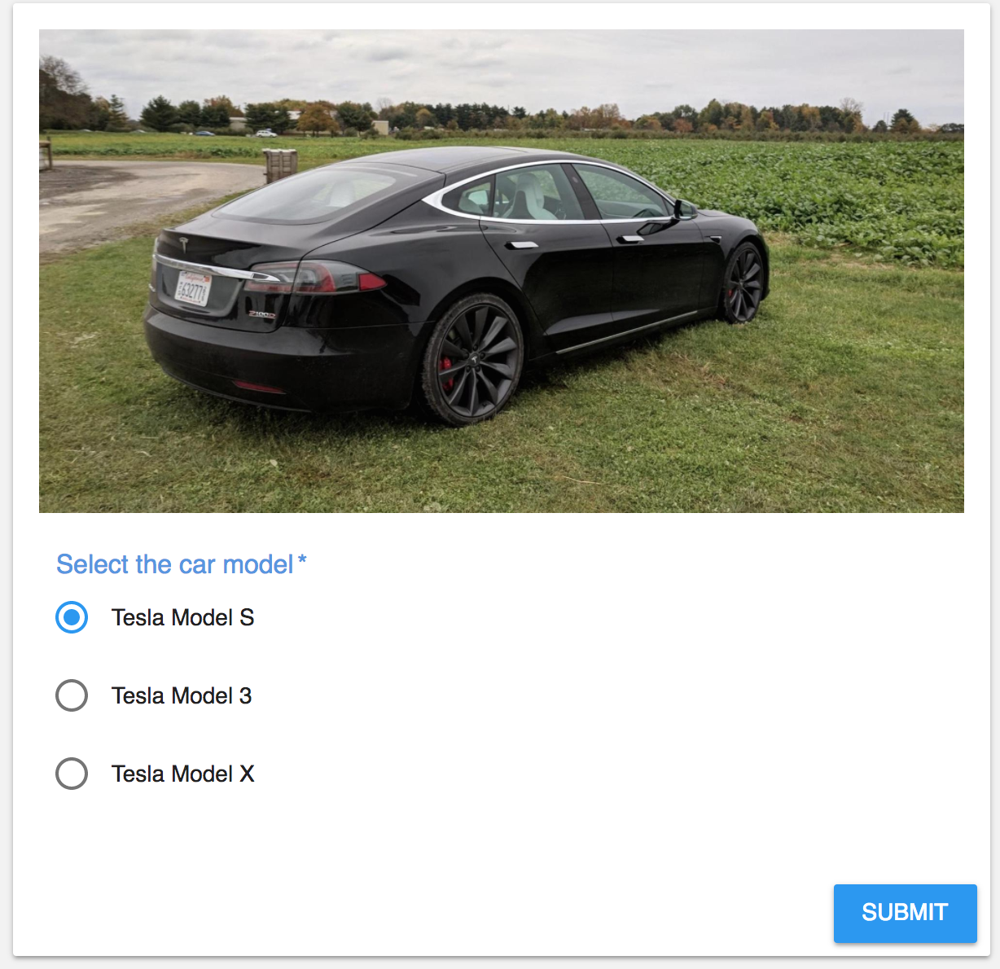
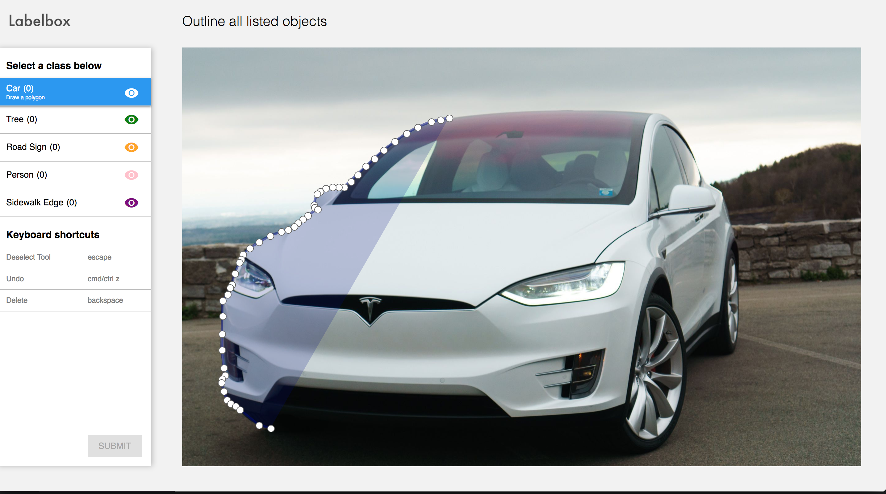
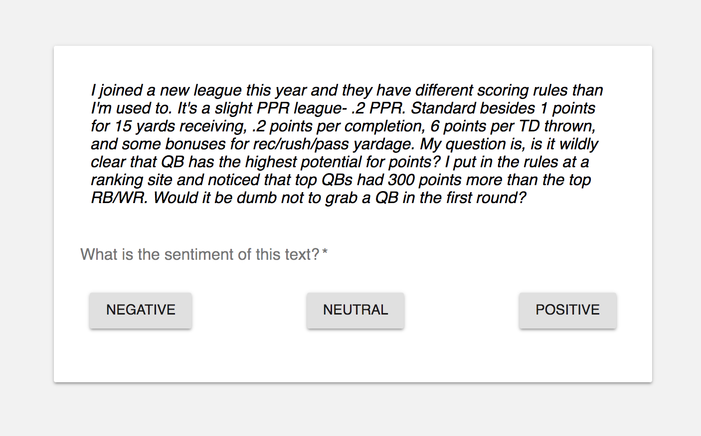

Table of Contents
=================

   * [Labelbox](#labelbox)
      * [Benefits](#benefits)
      * [Architecture](#architecture)
      * [Getting started](#getting-started)
         * [Uploading dataset](#uploading-dataset)
         * [Customizing labeling template](#customizing-labeling-template)
            * [Image Segmentation Template](#image-segmentation-template)
            * [Image Classification Template](#image-classification-template)
            * [Text Classification Template](#text-classification-template)
         * [Exporting labels](#exporting-labels)
      * [Developing Labeling Templates](#developing-labeling-templates)
         * [Image Classification](#image-classification)
         * [Image Segmentation](#image-segmentation)
         * [Text Classification](#text-classification)
      * [Using labeling-api.js](#using-labeling-apijs)
         * [Attach the Labelbox's client side api.](#attach-the-labelboxs-client-side-api)
         * [Get a row to label](#get-a-row-to-label)
         * [Save the label for a row](#save-the-label-for-a-row)
         * [Full Example](#full-example)
      * [Local Labeling Frontend Development](#local-labeling-frontend-development)
         * [Run localhost server](#run-localhost-server)
      * [Installing Labeling Frontend in Labelbox.io](#installing-labeling-frontend-in-labelboxio)
         * [Install Now](#install-now)
         * [Deploy labeling frontend](#deploy-labeling-frontend)
         * [Add labeling frontend to your Labelbox project](#add-labeling-frontend-to-your-labelbox-project)
      * [Request Features](#request-features)

# Labelbox
[Labelbox](https://www.labelbox.io/) is a cloud based data labeling tool designed for enterprises for machine learning applications.


## Benefits
- Simple Image Labeling: Labelbox makes it really easy to do basic image classification or segmentation tasks. To get started, simply upload your data or a CSV file containing URLs of data that is already hosted in a cloud, select an image classification or segmentation labeling template, invite collaborators and start labeling.

- Label just about anything: Not only are Labelbox templates open source, you can build your own templates using Labelbox.js. Build your own custom labeling template to label any kind of data as long as it can be loaded in a browser

- Manage Teams: Ready for your team, no matter the size. Labelbox streamlines your workflows, from micro labeling projects for quick R&D to production grade projects requiring hundreds of collaborators

- Monitor Performance: Maintain the highest quality standards for your data by keeping track of labeling task performance of individuals and teams

## Getting started
To immediately benefit from Labelbox, you must have a dataset ready to be labeled.

### Uploading dataset
1. **Uploading dataset from local computer**
 Select your data from your local computer to upload. Your data is uploaded in a secure cloud bucket and only you have access to it.
2. **Importing dataset from cloud**
 If your data is already hosted in a cloud e.g. Amazon S3, you can import data into Labelbox by creating a CSV file with URLs to each data point. [Checkout an example CSV file containing image URLs](./documentation-assets/self-driving-images.csv).


### Customizing labeling template
Labelbox has the following few pre installed labeling templates for out of the box labeling of most common data types.

#### Image Segmentation Template
 Labelbox image segmentation template can be used to label multiples classes of objects in an image. Supported annotation tools are:
 - Rectangle
 - Polygon

  Let's say an organization wants to segment 2 objects in an image. One object is required to be labeled using a rectangle tool and other with a polygon tool. Simply edit the segmentation template with the JSON snippet below:

  ```
{
  "tools": [
    {
      "name": "Object 1",
      "color": "navy",
      "tool": "polygon"
    },
    {
      "name": "Object 2",
      "color": "green",
      "tool": "rectangle"
    }
  ]
 }
 ```


#### Image Classification Template
 Assign an input image one label from a fixed set of categories. Categories can be customized similarly to the example above.

#### Text Classification Template
 Assign an input text one label from a fixed set of categories. Categories can be customized similarly to the example above.

### Exporting labels
All labels can be exported in a CSV or JSON format.

**Generating Segmentation Masks**
Image masks are great way to know what pixels in the image belong to a label class. Using image masks means less data preparation on your end for training machine learning model.

Labelbox generates image mask per label class i.e. If there are 2 car and 2 tree labels in an image, we will generate 2 image masks in total (car and tree). White pixels in the image mask represent the object.


## Developing Labeling Templates
All the available labeling templates are open source under MIT license.

### Architecture
Labelbox streamlines entire workflow of creating and managing data labels. While Labelbox makes it extremely simple to label most commonly used datatypes such as images and text, there are variety of other data types such as point clouds, maps, videos or medical DICOM imagery that requires bespoke labeling interface. With this in mind, Labelbox is designed such that an organization can simply create the frontend (with basic HTML/JS) and install it in Labelbox, without spending costly resources to develop user, team, data and label management features and worrying about deployment and maintenance.

Labelbox is data agnostic and all labeling projects share the theme of "data in and labels out".


Please see [labeling frontend templates](#labeling-frontend-templates) for templates relevant to your labeling task.

## Using labeling-api.js
To develop a Labelbox frontend, import labeling-api.js and use the 2 APIs described below to **Fetch** and **Submit** an individual dataset row. Note that multiple data can be loaded in a single Fetch if a row in CSV file contains an array of data.

### Attach the Labelbox's client side api.

```html
<script src="https://api.labelbox.io/client/v0.1/labeling-api.js"></script>
```

### Get a row to label

```javascript
Labelbox.fetchNextAssetToLabel().then((dataToLabel) => {
  // ... draw to screen for user to view and label
});
```

### Save the label for a row

```javascript
Labelbox.setLabelForAsset(label); // labels the asset currently on the screen
```

### Full Example
Full Example

```html
<script src="https://api.labelbox.io/client/v0.1/labeling-api.js"></script>
<div id="form"></div>
<script>
function next(label){
  if (label) {
    Labelbox.setLabelForAsset(label);
  }
  Labelbox.fetchNextAssetToLabel().then(drawItem);
}

function drawItem(dataToLabel){
  const labelForm = `
    </img>
    <div style="display: flex;">
      <button onclick="next('bad')">Bad Quality</button>
      <button onclick="next('good')">Good Quality</button>
    </div>
  `;
  document.querySelector('#form').innerHTML = labelForm;
}

next();
</script>
```

### Available Templates

1. [Image Classification Template Source Code](https://github.com/Labelbox/Labelbox/tree/master/templates/image-classification)
<!--  -->


2. [Image Segmentation Template Source Code](https://github.com/Labelbox/Labelbox/tree/master/templates/image-segmentation)

<!--  -->


3. [Text Classification Template Source Code](https://github.com/Labelbox/Labelbox/tree/master/templates/text-classification)

<!--  -->

## Local Labeling Frontend Development

### Run localhost server
1. Start the localhost server in a directory containing your labeling frontend files. For example, run the server inside labelingfrontend if you have index.html (labeling frontend) inside it.
```
python2 -m SimpleHTTPServer
```
2. Copy file path to the main HTML file. Following the example above, it would look like localhost:8000/index.html

3. Paste the path of labeling frontend under Custom Labeling Interface for an existing project.

 


## Installing Labeling Frontend in Labelbox.io
At Labelbox, we are fan of https://zeit.co/now for cloud deployment.

### Install Now
Create an account at Zeit, download and install Now here: https://zeit.co/download

### Deploy labeling frontend
In terminal, go to your labeling frontend directory and type: ```now``` and copy the link.

### Add labeling frontend to your Labelbox project
Paste the link under custom labeling interface tab, as shown in the video below. Now you are ready to label data with your team using the custom frontend.


## Request Features
Have a feature request or you'd like us to make a labeling template for you?

Create an issue here: https://github.com/Labelbox/Labelbox/issues or contact us at support@labelbox.io
