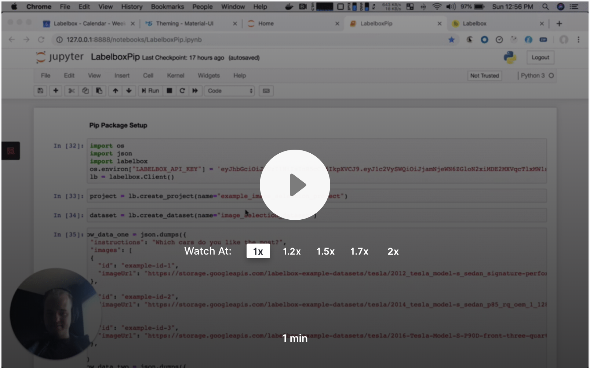
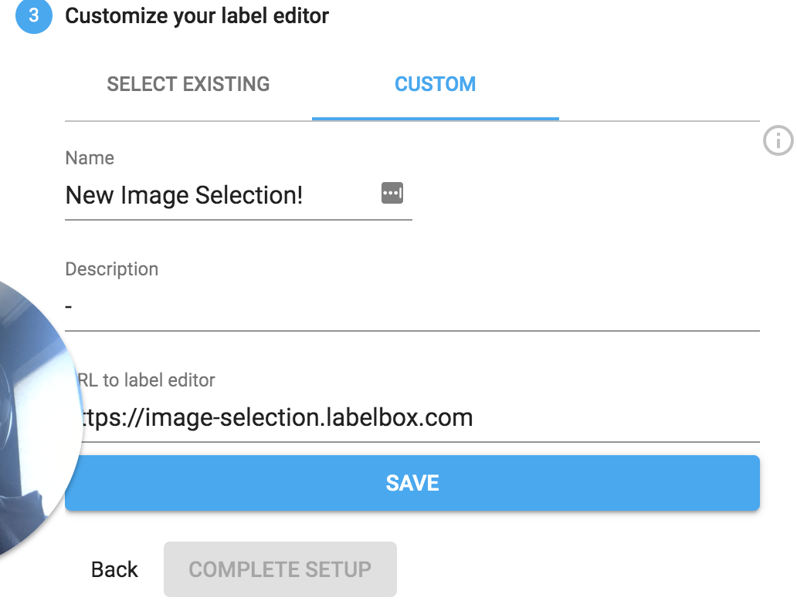

## Video Overview

[](https://www.loom.com/share/5b53617b027d4ef382d56a8dcc6ca5f1)

## Interface Setup

URL: https://image-selection.labelbox.com



## Interface Input

```
[{
  "instructions": "<p>Which cars do you like the most?</p>",
  "referenceImage":"https://storage.googleapis.com/labelbox-example-datasets/tesla/104836109-p100d-review-5.1910x1000.jpeg",
  "externalId":"abadsf99w11",
  "data": [{
    "externalId": "ab65d5e99w12",
    "imageUrl": "https://storage.googleapis.com/labelbox-example-datasets/tesla/104836109-p100d-review-5.1910x1000.jpeg"
  },
  {
    "externalId": "abadsf99w13",
    "imageUrl": "https://storage.googleapis.com/labelbox-example-datasets/tesla/104836109-p100d-review-5.1910x1000.jpeg"
  }]
}]
```

The fields `referenceImage` and outer `externalId` is optional.
The field `instructions` can receive either a HTML or a string.

## Interface Label Output

```
{
  "referenceImage":"https://storage.googleapis.com/labelbox-example-datasets/tesla/104836109-p100d-review-5.1910x1000.jpeg",
  "externalId": "abadsf99w11",
  "label": [
    {
      "externalId": "ab65d5e99w12",
      "imageUrl": "https://storage.googleapis.com/labelbox-example-datasets/tesla/104836109-p100d-review-5.1910x1000.jpeg"
    },
    {
      "externalId": "ab65d5e99w13",
      "imageUrl": "https://storage.googleapis.com/labelbox-example-datasets/tesla/104836109-p100d-review-5.1910x1000.jpeg"
    }
  ],
}
```

The fields `referenceImage` and outer `externalId` will exist only if they existed in the respective input.