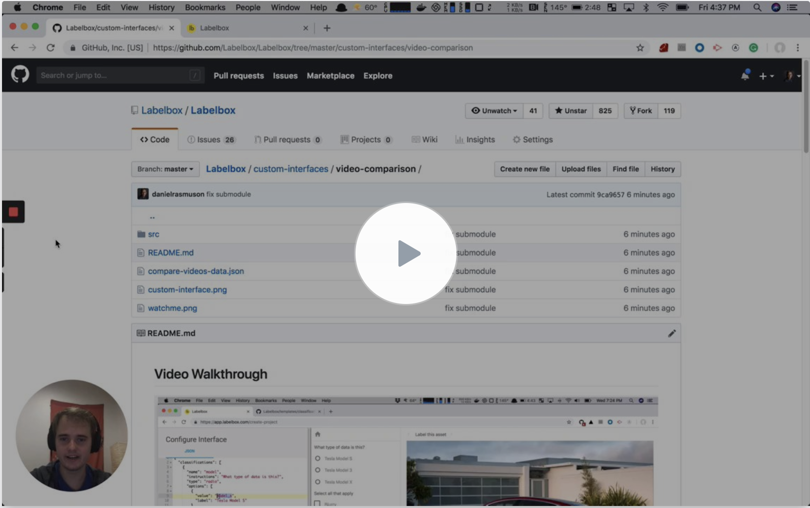
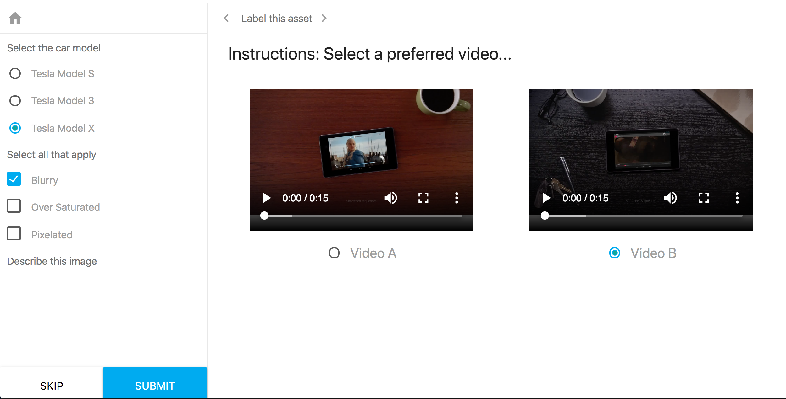

## Video Walkthrough

[](https://www.useloom.com/share/97e20c8e3ab345ad996cc4c8f3b4cdae)

## Running this example

1. Create an account on labelbox
2. Make a new project, "Compare-Videos Example"
3. Import the file "compare-videos-data.json"
4. Open index.html in your browser
5. Select your new project "Compare-videos Example"

## Installing template into Labelbox

To install this template and use it with realtime customization following the below steps.

1. Create a new custom interface with this URL https://compare-videos.labelbox.com/.



2. Click edit and paste this JSON in over default JSON

```
{
  "classifications": [
    {
      "name": "model",
      "instructions": "Select the car model",
      "type": "radio",
      "options": [
        {
          "value": "model_s",
          "label": "Tesla Model S"
        },
        {
          "value": "model_3",
          "label": "Tesla Model 3"
        },
        {
          "value": "model_x",
          "label": "Tesla Model X"
        }
      ]
    },
    {
      "name": "image_problems",
      "instructions": "Select all that apply",
      "type": "checklist",
      "options": [
        {
          "value": "blur",
          "label": "Blurry"
        },
        {
          "value": "saturated",
          "label": "Over Saturated"
        },
        {
          "value": "pixelated",
          "label": "Pixelated"
        }
      ]
    },
    {
      "name": "description",
      "instructions": "Describe this image",
      "type": "text"
    }
  ]
}
```

## Adding your own data

Labelbox needs stringifed JSON to run this example...

```
"{\"compare\":{\"a\":{\"id\":\"your-db-id-89E30C47-5807-5622-AA3D-D390AFE53728\",\"url\":\"http://commondatastorage.googleapis.com/gtv-videos-bucket/sample/BigBuckBunny.mp4\"},\"b\":{\"id\":\"your-db-id-0D10F70F-F865-A5B0-A548-7CB0176324AF\",\"url\":\"http://commondatastorage.googleapis.com/gtv-videos-bucket/sample/ElephantsDream.mp4\"}}}"
```

The non stringifed version of the above is...

```
{
  "compare": {
    "a": {
      "id": "your-db-id-89E30C47-5807-5622-AA3D-D390AFE53728",
      "url": "http://commondatastorage.googleapis.com/gtv-videos-bucket/sample/BigBuckBunny.mp4"
    },
    "b": {
      "id": "your-db-id-0D10F70F-F865-A5B0-A548-7CB0176324AF",
      "url": "http://commondatastorage.googleapis.com/gtv-videos-bucket/sample/ElephantsDream.mp4"
    }
  }
}
```

Note: The video ID from above is what will be used in the output label.
